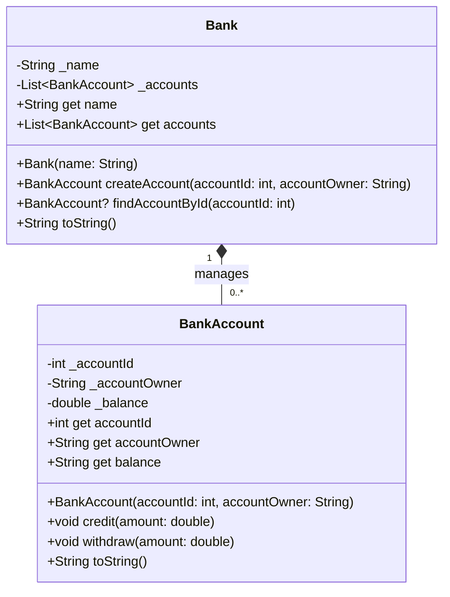

```mermaid
classDiagram
    class Bank {
        -String _name
        -List~BankAccount~ _accounts
        +Bank(name: String)
        +String get name
        +List~BankAccount~ get accounts
        +BankAccount createAccount(accountId: int, accountOwner: String)
        +BankAccount? findAccountById(accountId: int)
        +String toString()
    }

    class BankAccount {
        -int _accountId
        -String _accountOwner
        -double _balance
        +BankAccount(accountId: int, accountOwner: String)
        +int get accountId
        +String get accountOwner
        +String get balance
        +void credit(amount: double)
        +void withdraw(amount: double)
        +String toString()
    }

    Bank "1" *-- "0..*" BankAccount : manages
```