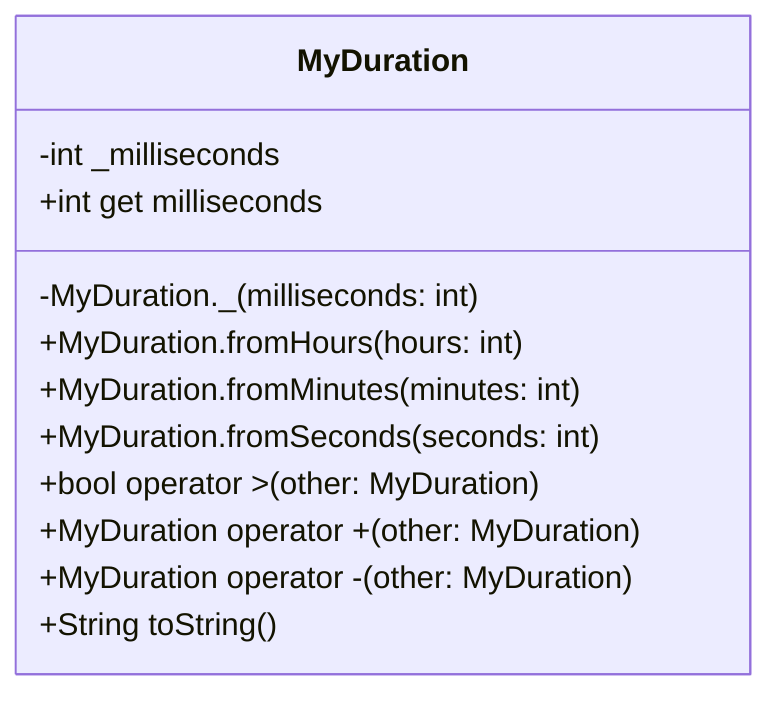

```mermaid
classDiagram
    class MyDuration {
        -int _milliseconds
        -MyDuration._(milliseconds: int)
        +MyDuration.fromHours(hours: int)
        +MyDuration.fromMinutes(minutes: int)
        +MyDuration.fromSeconds(seconds: int)
        +int get milliseconds
        +bool operator >(other: MyDuration)
        +MyDuration operator +(other: MyDuration)
        +MyDuration operator -(other: MyDuration)
        +String toString()
    }
```